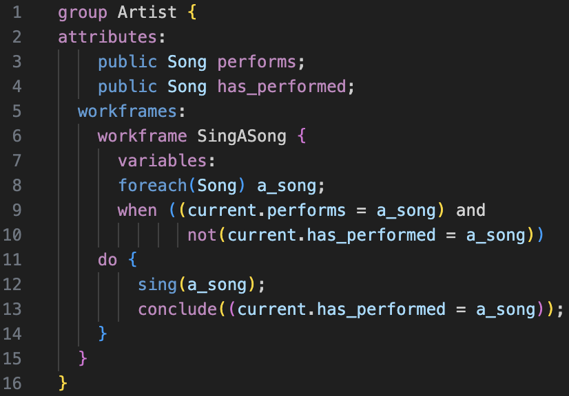

# Brahms Syntax Highlighting

Brahms is an Agent Oriented Programming Language developed by NASA for modeling human behavior in complex systems. It is used for simulating workflows, interactions, and decision-making processes involving humans and machines. Brahms focuses on tasks, actions, and workframes, providing a structured way to model both routine and unexpected behavior in multi-agent systems.

This extension provides syntax highlighting for Brahms source code (`.b` files), making it easier to write, read, and debug Brahms programs in Visual Studio Code.

## Features

- Syntax highlighting for:
  - **Agents** and **Groups**
  - **Workframes** and **Variables**
  - **Beliefs** and **Actions**
  - **Logical Operators** (`and`, `or`)
  - **Loops** (`foreach`)
  - **Comments, Strings, and Numbers**

## Requirements

No external dependencies are required for this extension. Simply install and use.

## Extension Settings

This extension does not introduce any custom settings at the moment. Future versions may add configuration options for customizing the syntax colors.

## Known Issues

- Currently, workframe and variable detection is case-sensitive.
- Some advanced features of Brahms (like custom operators) may not yet be fully supported.

## Release Notes

### 1.0.0

Initial release of Brahms Syntax Highlighting for Visual Studio Code. This version provides basic syntax highlighting for key Brahms constructs including agents, groups, workframes, and logical operators.
